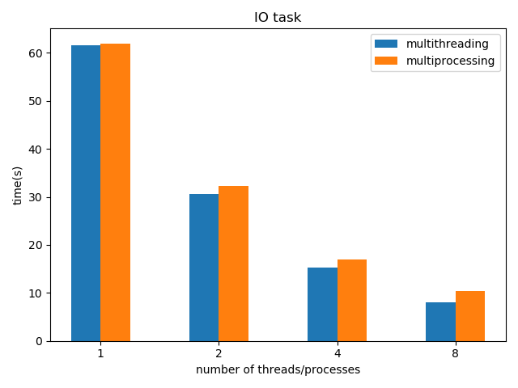
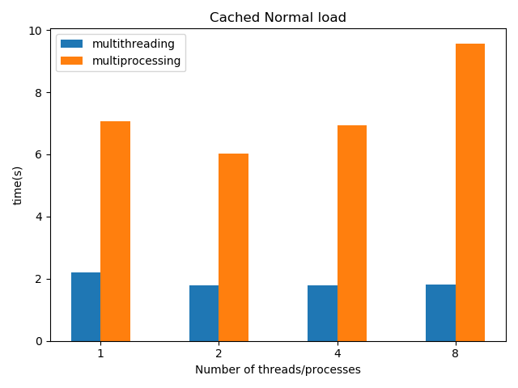
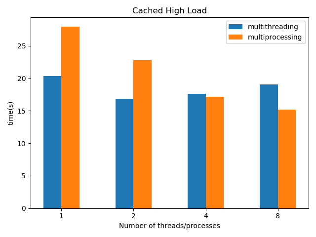
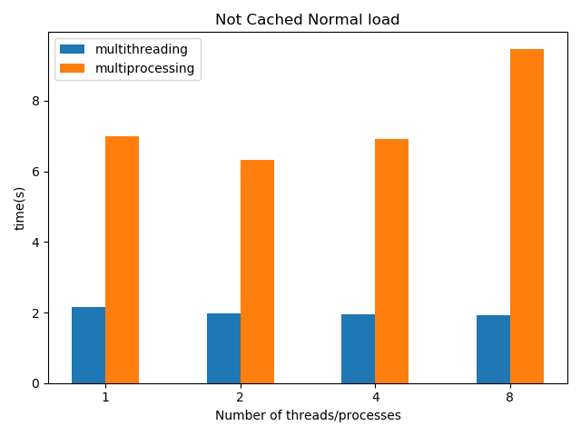
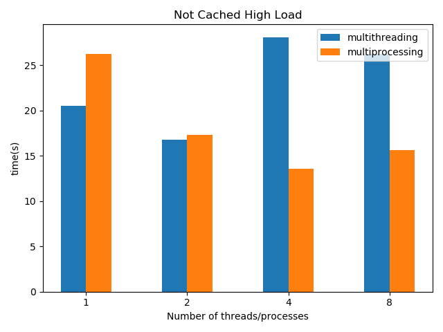

## Multiprocessing vs Multithreading in Python

#### Baseline and Gotchas
1. Multithreading to be used when there are blocking operations.Eg IO,network etc such as getting images from web and saving them to the disk
2. Multithreading won't do well in CPU intensive task due to GIL in python which allows only one thread to run at a time.Thus using multithreading in blocking operations makes sense
3. Multiprocessing does well in CPU intensive task as multiple processes would bypass the GIL limitation.
4. Threads are typically lightweight and start instantaneously whereas processes are spawned/forked and slow to start.
5. Combining data at the end processes involves use of multiprocessing queue which is a bit slower resulting in deterioration of multiprocessing performance.
6. Transferring large amount of data through a multiprocessing queue may end up in a deadlock as they are implemented using OS pipes which are not infinitely long and may block until some process uses get() to retrieve data.

#### Observations 

1. IO task comparision

    * Multithreading as expected performs better than serial and multiprocessing.
    
2. CPU task comparision
    * Normal load process with caching the output(using lists and queues)
            
        * Here multiprocessing performs unexpectedly bad as the task was not intensive enough.Spawing new processes is slow which is illustrated by decrease in performance with increase in number of processes.Also using queue for caching is also pretty slow thus affecting the performance.
        * Any benifit of multiprocessing was overshadowed by delay due to launching of a process and slow queue put()
     
    * High Load process with caching the output
            
        * Here multiprocessing outperforms multithreading as expected.
    
    * Normal load process with no caching
            
        * Here multiprocessing performs poor as mentioned in first case except the slowness induced by queue.As caching is removed here,it performs better than the first case.
    
    * High load process with no caching
            
        * Here multiprocessing perform best as expected.
            
3. Resources
    * https://sumit-ghosh.com/articles/multiprocessing-vs-threading-python-data-science/
    * https://stackoverflow.com/questions/31665328/python-3-multiprocessing-queue-deadlock-when-calling-join-before-the-queue-is-em
    * https://docs.python.org/3/library/multiprocessing.html#multiprocessing-programming